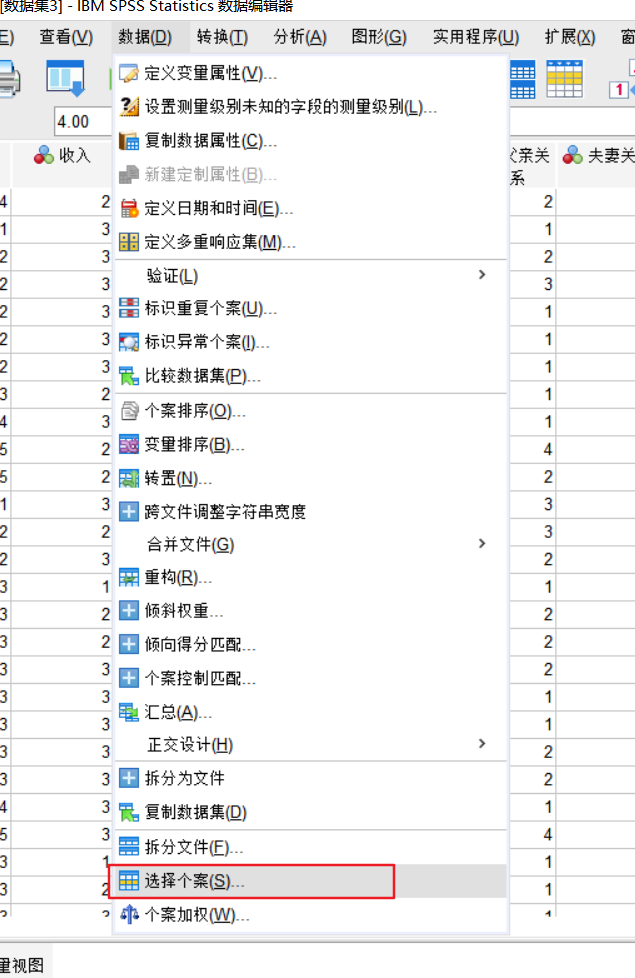

# SPSS 期末

## 探究活动与知识形态之间的关联
### 经验研究——实践知识
经验探究对应的是实践的知识，往往是日常的、个人的、实践的知识。对应教育研究：教育实践-策略（浅谈如何控制儿童玩电子游戏）
### 实证探究——科学知识
实证探究对应的是科学的知识，往往是科学的、事实的、因果的知识。对应教育研究：教育事实-规律（电子游戏与学习成绩的相关性研究）
### 思辨探究——哲学知识
思辨探究对应的是哲学的知识，往往是哲学的、价值的、理念的知识。对应教育研究：教育价值-理念（论好学生的价值标准）

## 教育知识的“三重奏”/三种命题
- 价值命题——教育目的：什么是好的教育
- 事实命题——教育规律：方法与结果之间的因果关系
- 实践命题——教育策略：如何实施教育活动

## 什么是教育科学研究
教育科学研究是以实证的方法来研究教育现象，具有三种规范的研究范式：
- 实证——量的研究方法
- 实地——质的研究方法
- 思辨——哲学研究方法

## 什么是实证研究
实证研究是一种科学的研究方法论，以可观察的事实为研究对象的可重复进行的系统观察，其结论是可检验的、原则上可证伪的知识。关键词在于“实证”，即寻求事实资料已检验某个假设是否成立的探究活动。它具有三个特征：
- 研究对象：可观察性
- 研究过程：可重复性
- 研究结果：可证伪性

实证研究的基本步骤：
1. 提出假设
2. 收集资料
3. 分析资料
4. 验证假设

## 是定量（量化）研究
### 定义
量化研究是指将问题与现象用数量来表示进而去分析、考验、解释从而获得意义的研究方法，其特点是：
- 先建立假设并确立各种关系变量
- 概率抽样选取样本并使用经过检测的标准化工具采集数据
- 对数据进行分析、验证。检验关于事物客观规律的理论假设
- 研究者本人在研究过程中尽量做到价值中立

### 哪些问题适用于量化研究？
- 教育政策、教育规划、教育预测——发现问题，提出解决问题的新视角
- 课程改革、教育评估、学生发展评价、描述和预测性探究——发现和推断特征与模型
- 能够证实和证伪的理论假设，并不断地修改和完善已有的假设——对教育实践产生影响

### 如何做好定量研究？
方法是工具，工具很重要但是也不是万能的；切莫把手段当成目的，不玩数字游戏；拼想法，一个好的想法是“意料之外，情理之中”不能天马行空；理论要贯穿研究的整个过程；重视基础，不要追求所谓“高大上”的方法；重视阅读，多读一些名家论文，学习其中的理论与方法；重视操练，带着问题去实操，学以致用。

---
## 问卷篇
### 问卷调查的定义
问卷是社会调查中用来收集资料的一种工具，在形式上是一份精心设计的问题表格，其用途是用来测量人们行为、态度和社会特征。其类型包括：
- 自填式问卷，即被调查者自己填写的问卷
- 访问式问卷，即调查员根据被调查者的问答进行填写的问卷

### 为什么教师行动研究需要问卷调查？
- 行动研究需要走出书斋，直面问题。
- 行动研究需要以科学的方式研究问题。
- 行动研究必须开药方，但前提是摸清楚病情。
- 问卷调查是测量教育实践状况的最普遍工具。

### 问卷的基本结构
- 封面信，致被调查者的一封短信，包含了：调查主板单位和个人身份，调查的内容和范围，调查的目的和意义，隐私保护
- 指导语，教被调查者如何正确填写问卷，包括卷头和卷中指导语
- 问题和答案（开放式问题不要太多且尽可能放到最后）
  - 开放式问题，优点在于不受限制表达意见，资料丰富；缺点在于，被调查者需要一定的知识水平和文字表达能力，问卷填写需要耗费较多时间，资料难于进行定量分析和处理。
  - 封闭式问题，优点在于对文字表达能力无特殊要求，填写方便资料便于处理和定量分析；缺点在于对于答案的设计要全面合理。
- 对于答案的要求，具备完备性和互斥性

### 问卷设计的基本步骤
- 探索性工作：对不熟悉的问题一定要有探索性工作，查找是否有成熟的问卷
- 设计问卷初稿：
  - 构思出问卷的整体结构，确定几大模块
  - 具体写出每个模块的问题，可以与人合作
  - 对全部问题的形式、前后顺序进行整体修订，注意模块的顺序与逻辑性
- 试调查：
  - 选定十几个样本，无需科学抽样
  - 注意某些拒绝填写率过高、答案高度一致的题目
- 修改并定稿：
  - 将问卷交给相关专家，由专家给出主观评价
  - 结合调查者和专家的意见，综合协商修改并最终定稿

## 正态性检验 | 假设检验
### SPSS怎么进行正态性检验？
分析 - 描述统计 - 探索 - 把需要检测的变量选中放入“因变量列表” - 图 - 取消茎叶图，选择直方图和“含检验的正态图” - 确定

### 怎么看SPSS正态性检验后输出的结果？
- 看偏度和峰度

- 正态性检验的显著性 > 0.05

- 直方图大致呈现左右对称的钟形，无很远的值
- Q-Q图中的散点大致与斜线吻合

## 相关关系T检验——连续变量相关分析：皮尔逊r相关分析
### 什么情况下选择使用皮尔逊r相关分析？
- **数据类型：** 两个连续型变量，例如：身高、体重、年龄、血压、薪资、GPA等
- **研究目的：** 检测两个连续型变量之间是否存在“关联”
- 举个栗子：
  - 研究“身高越高的人体重是否越重？”
  - 研究“玩手机的时间越长是否成绩越差？”
### SPSS如何具体操作？
1. 识别两个变量的数据类型，是否都是连续型变量
2. 如果样本量<30则需要进行正态性检验，不符合正态性，则选择肯德尔斯皮尔曼r检验
3. 以上都符合后，进行皮尔逊r检验

**软件操作**： 分析 - 相关 - 双变量 - 选中皮尔逊，双尾 - 确定
### 对于SPSS的输出结果如何解读？
找到相关性的表进行如下解读：

**相关性强度：**
- |r| > 0.7 表示变量间存在高度相关关系
- 0.5 < |r| <= 0.7 表示变量间存在中度相关关系
- 0.3 < |r| <= 0.5 表示变量间存在低度相关关系
- 0.3 <= |r| 表示变量间不存在线性相关关系
### 如何撰写结果？
通过``相关关系T检验(皮尔逊r)``得知，``XXXXXXX``的相关系数r = ``XXXX``, p =``XXXX``,两者相关（显著/不显著），相关系数强度（高/中/低）,说明``XXXXXXXXX,接受假设HX,拒绝假设HX。``

## 单样本t检验
### 什么情况下使用单样本t检验？
- **数据类型**：一个连续型变量，例如身高、体重、薪资
- **研究目的**：对比该变量的``平均值``与某一个``特定值``是否有显著差异
- **举个栗子**：
  - 大学生的平均身高是否高于或者低于1.65cm？
  - 中年人平均月薪是否比2500元高或低？
### SPSS具体如何操作？
:::warning 当样本量小于30需要做假设检验
分析 - 描述统计 - 探索
:::
- 假设检验的五个条件都满足则继续进行正式单样本t检验
- 正式单样本t检验：分析 - 比较平均值 - 单样本t检验 - 选择检验变量 - 填写检验值 - 确定
- 列举假设H0和备选假设H1（以大学生平均身高为例）
  - H0：大学生平均身高与1.65m不存在显著差异
  - H1：大学生平均升高与1.65m存在显著差异
### 如何解读SPSS输出结果？
- 看Sig值：
  - 若小于0.05则拒绝假设H0，接收假设H1，即大学生的平均身高与检验值1.65m存在显著差异
  - 若大于0.05则接收假设H0，拒接假设H1，即大学生的平均升高与检验值1.65m不存在显著差异
- 看t值：t值的正负形代表大学生的平均升高是否大于检测值1.65m：正则大于，负则小于。

### 如何撰写结果？

## 独立样本t检验
### 什么情况下使用独立样本t检验？
- **数据类型**：所有被试被自变量分为两组，因变量为连续型变量；例如，男生女生的体重、南方人与北方人的工资
- **研究目的**：检测因变量在两组内是否存在显著差异
- **举个栗子**：
  - 大学男生和女生体重是否存在显著差异？
  - 南方人和北方人的工资是否存在显著差异？
### SPSS具体怎么操作？
- 先进行假设检验：
  - 方差齐性检验
  - 检验正态性（当样本量<30的时候进行）
- 正式独立样本t检验： 分析 - 比较平均值 - 独立样本T检验
- 以大学生男女体重是否存在显著差异为例，提出虚无假设H0：男女生体重没有显著差异，提出备选假设H1：男女生体重存在显著差异。
### 如何解读SPSS输出结果？

### 如何撰写结果？
:::tip 解读
- 看方差齐性检验显著性值，如果大于0.05则表示方差齐性，看第一行；反之看第二行。
- 看Sig双尾值，如果小于0.05说明：H0出现小概率事件，拒绝H0接收H1；反之接收H0
:::

## 配对样本T检验
### 什么情况下使用配对样本T检验？
- **数据类型**：每个参与者被测量两次，且连续型被试间变量，例如，饭前饭后的体重、药前药后的血压
- **研究目的**：对比两次测量数值是否有显著差异
- **举个栗子**：
  - 大学生饭前与饭后体重是否存在显著差异？
  - 高血压病人吃降压药前后血压是否有显著差异？
### SPSS具体如何操作？
- 如果样本量小于30则先进行假设检验
- 正式配对样本t检验： 分析 - 比较平均值 - 配对样本t检验
- 以饭前饭后体重差异为例，提出虚无假设H0：饭前饭后体重没有显著差异；备选假设H1饭前饭后体重存在显著差异。
### 如何解读SPSS输出结果？

### 如何撰写结果？

## 单因素方差分析 ANOVA
### 什么情况下进行单因素方差分析？
- **数据类型**：所有被试自变量分为三组或者三组以上，因变量为连续型变量。例如，研究来自四个不同专业的学生体重、研究来自三个城市的居民的工资。
- **研究目的**：检测因变量在若干组内是否存在显著差异
- **举个栗子**：
  - 来自四个专业的学生的体重是否存在显著差异？
  - 来自三个城市的居民工资是否存在显著差异？
### SPSS如何具体操作？
- 先进行假设检验，检验**方差齐性**
- 进行单因素方差分析： 分析 - 比较平均值 - 单因素方差分析
- 多重比较
### 对于SPSS输出结果如何解读？
#### 方差齐性检验结果怎么看？

#### 单因素方法分析结果怎么看？

:::tip 解读
这里Sig值小于0.05说明被试组之间存在显著差异，因此我们需要继续进行**事后多重比较。**如果不显著，说明不存在显著差异，所以后面不用做了。
:::
- 方案一：两两做独立样本T检验（麻烦）
- 方案二：多重比较
#### 多重比较输出图表怎么看？

## 卡方检验
### 什么情况下采用卡方检验？
- **数据类型**：两个分类变量
- **研究目的**：研究两个分类变量之间的相关性
- **举个栗子**：
  - 性别与资格考试通过是否有关
  - 某病毒发病率与性别是否有关
### SPSS如何操作？
:::tip 以研究男生女生居住地有没有区别（判断x，y变量之间是否有关系）为例
:::
- 分析 - 描述统计 - 交叉表 - 选取行列变量 - 统计 - 选择卡方 - 确定

### 如何解读数据？

- 由上图所示，显著性0.66大于0.05，所以接受原假设H0，即性别与居住地之间不存在显著差异。
- X2来反映差异得大小，如果存在差异，X2越大则差异越大，反之越小。

---

## 缺失值计算
转换>计算变量>Nmiss函数

## 计算变量
### 计算家庭美德的总分
转换>计算变量> 把所有需要累加的变量拖进去，用+号表示相加

### 求平均值
转换>计算变量> (x1 + x2 + x3 + ...) / n 也可以使用MEAN(x1,xn)计算1-n项的平均值

## 重新编码变量
建议使用重新编码为不同的变量

### 统计父亲的学历（分为有无接受过高等教育）

### 反向题几分处理
比如原数据1代表优而5代表差，需要反向处理成1代表差积分低而5代表高积分

在新旧值将原先的1->1; 2->2...转换成 1->5;2->4...即可

## 个案选择

比如，原统计数据性别有男有女，我们现在只需要看女性的相关数据，那么就可以使用个案选择。

### 拆分文件
例如根据性别拆分，结果为性别1在前，性别2在后

### 练习
#### 按照母亲学历分为高中以下和高中以上
思路：重新编码 生成新的变量，高中教育以下的归为1，以上的归为2

转换 > 重新编码为**不同变量** > 选中 “母亲的学历” > 赋予新名称“母亲学历二分类” > 选中“旧值”与“新值” > 1\2\3 => 1 > 4\5\6 => 2 > 点集“继续”

#### 选择住在农村的女生，并生成独立的数据档
思路：个案选择 设定条件“性别为女生并且常住地为农村”

数据 > 个案选择 > 选中“如果条件满足” > 编辑条件“性别=2 & 常住地=1” > 继续 > 在“输出”栏选择“将选定的案例复制到新的数据集” > 编辑数据集名称 > 确定

## 排序
### 个案排序
数据 > 个案排序 > 输入条件 (还可以利用排序来查找缺失值)

## 数据预处理：数据净化
- 分析>描述性统计>探索

- M稳健估计值：减少异常值的影响，与原始的均值相比较变化不大，说明奇异值影响较小
- 离群值：最大和最小值

上限(上界)： 上四分位（75%以上） + 1.5*（上四分位-下四分位）

下限（下界）： 下四分位（25%以下） + 1.5*（上四分位-下四分位）

极上： 上四分位（75%以上） + 3*（上四分位-下四分位）

极下： 下四分位（25%以下） + 3*（上四分位-下四分位）

- 数据的标准化寻找异常值
- 标准化的目的：不同单位的数据可以进行比较
- 不同测量的尺放到同一个参考系，如米和英尺，5级和7级量表
- Z分数， 分数与平均值的差再除以标准差
- 注意政府三个标准差以外的个案